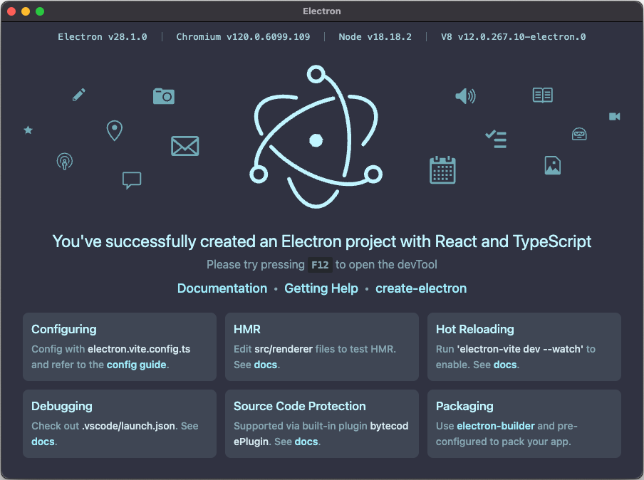

# electron-vite-react-ts

An [Electron](https://github.com/electron/electron) application with [React](https://github.com/facebook/react) and [TypeScript](https://github.com/microsoft/TypeScript), built with [Vite](https://github.com/vitejs/vite).

Created using [electron-vite](https://github.com/alex8088/electron-vite) and the [react-ts](https://github.com/alex8088/quick-start/tree/master/packages/create-electron/playground/react-ts) template.

`Package.json` scripts enhanced by [Wireit](https://github.com/google/wireit).

## Preview



## Project Setup

### Install

```bash
$ npm install
```

### Development

```bash
$ npm run dev
```

### Build

```bash
# For windows
$ npm run build:win
```

```bash
# For macOS
$ npm run build:mac
```

```bash
# For Linux
$ npm run build:linux
```
